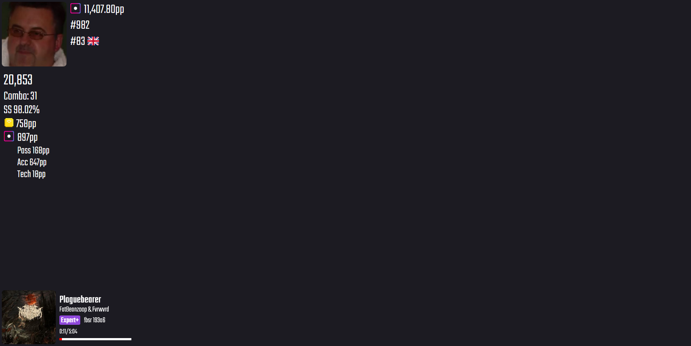

# BeatSaber Overlay with real-time data from HttpSiraStatus

The project is on my [Gitea](https://git.fascinated.cc/Fascinated/beatsaber-overlay) now, but the repo will be kept in sync on GitHub.  
The public url to view/use: <https://bs-overlay.fascinated.cc>  
Need help? Feel free to message me on Discord: Fascinated#7668 or Matrix: @fascinated:matrix.fascinated.cc

## Usage

Go to the [Wiki](https://git.fascinated.cc/Fascinated/beatsaber-overlay/wiki/Usage)

## Preview

## Getting started with developent

- Clone the repo
- Move into the cloned directory
- Run `npm install`
- Rename the `.env-example` to `.env`
- Create a redis server with a password
- Setup the `.env`
- Run `npm run dev`
- Open <http://localhost:3000>

If you want your changes to be in the main branch, feel free to open a pull request :)
